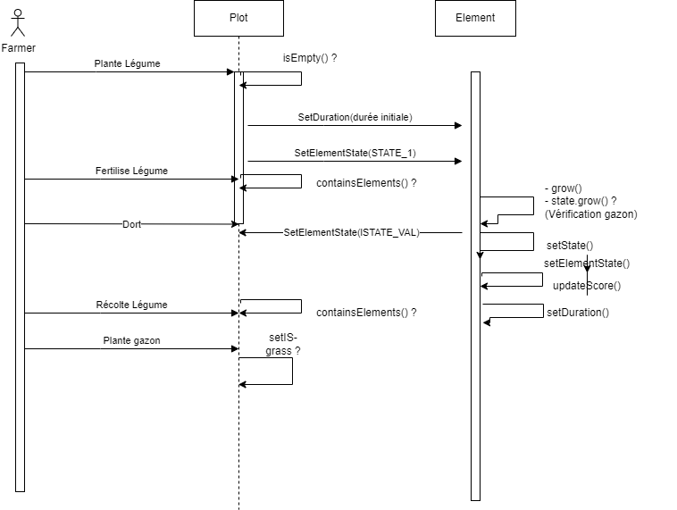
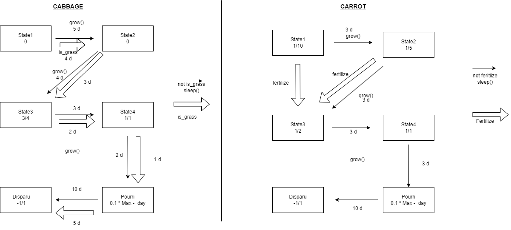
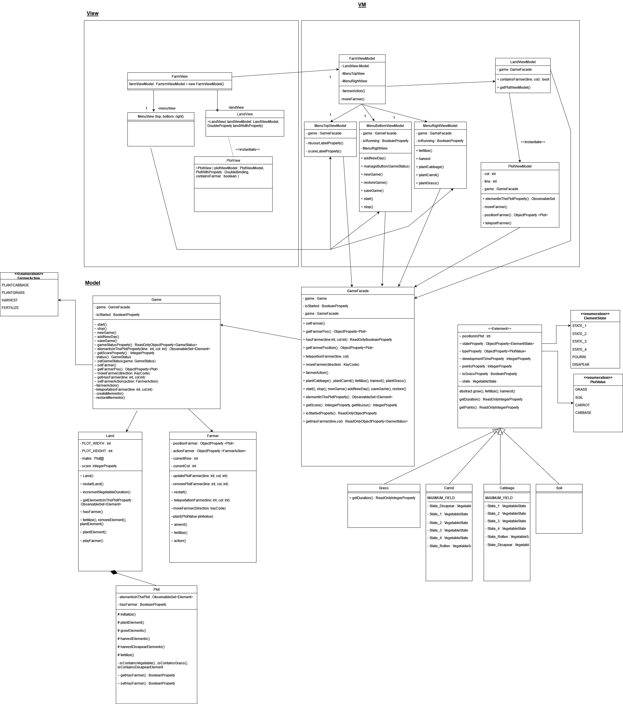
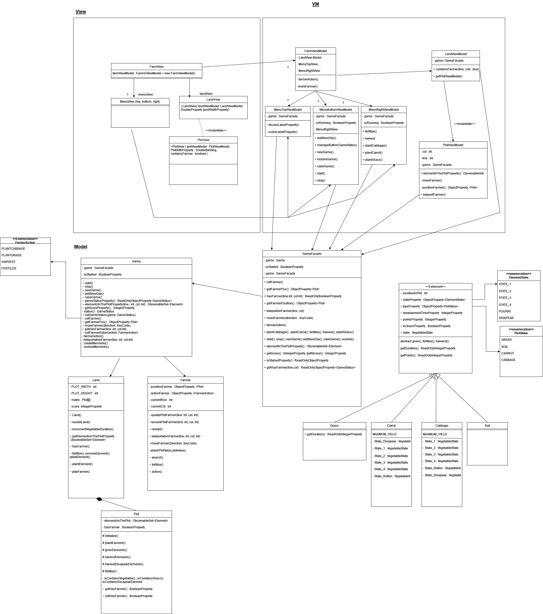

# Projet ANC3 2223 - Farming
* Marie Thielens 
* Pierre Simillion
## Notes de version itération 1 

Pour pouvoir utiliser le jeu dans l'état actuel : il faut cliquer sur le terrain de jeu avec la souris.
Ensuite il faut utiliser les fléches pour déplacer le personnage. Pour planter / deplanter de l'herbe il faut appuyer sur la
touche espace.
Vous pourrez trouver les diagrammes de classe en format png dans le dossier "Diagramme de classe". Nous avons également mis dans le readme un peu plus bas.

### Liste des bugs connus

  * Le focus ne se fait pas automatiquement sur le land sans clique
  * Les boutons ne sont pas correctement implémentés avec des actions
  * On a trafiqué les directions dans la classe farmer pour qu'elles fonctionnent
  * Lorsque l'on clique sur une case il plante de l'herbe au lieu de mettre le fermier à la nouvelle position
  * Léger padding entre les lignes à l'affichage des parcelles du terrain en fonction des écrans

### Diagramme de classe

### Liste des fonctionnalités supplémentaires

### Divers
  * Pour manipuler le fermier, il faut appuyer sur le bouton start et cliquer sur le terrain
    afin que le fermier puisse bouger, ainsi que planter et arracher le gazon.

## Notes de version itération 2

- Petite latence quand on clique sur le bouton start lors du lancement d'une seconde partie
- Le fermier ne revient pas en position 0,0 lors du lancement d'une seconde partie.

### Diagramme de séquance

Vous trouverez les diagrammes en format pdf dans le dossier Diagrammes

### Diagramme de classe

## Notes de version itération 3 

### Diagramme de classe

 - "+" : accès public (Toutes les autres classes ont accès à cet attribut)
 - "#" : accès protégé (Seules la classe elle-même et les classes filles (héritage) ont accès à cet attribut)
 - "~" : accès package (Classe visible uniquement dans le package.)
 - "-" : accès privé (Seule la classe elle-même a accès à cet attribut)

...